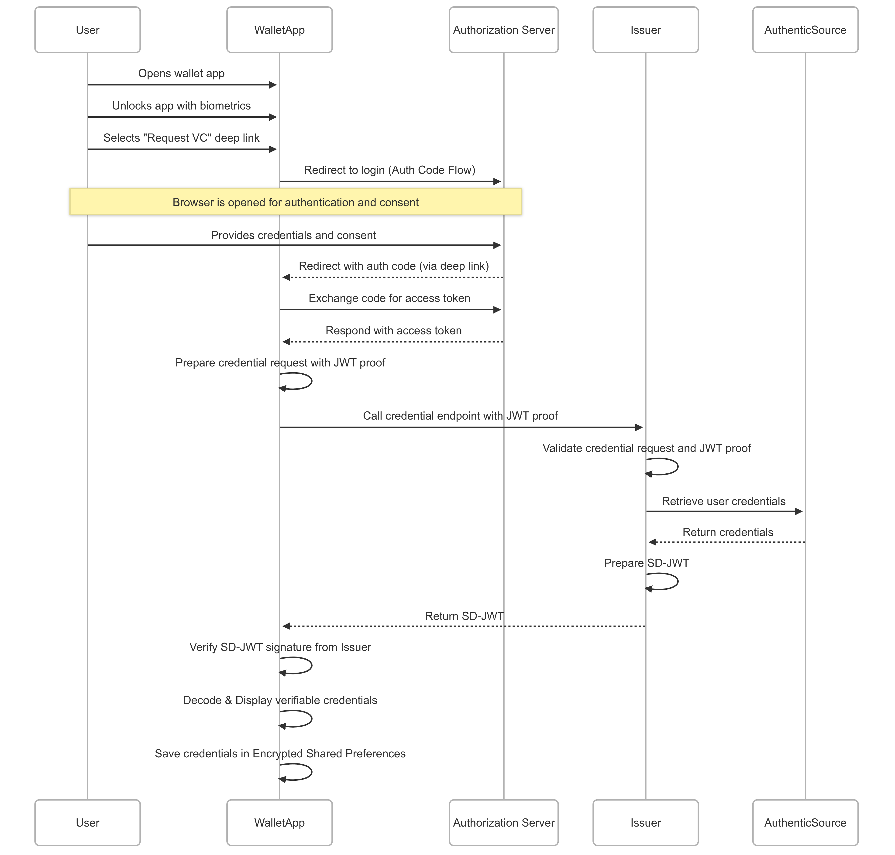

## VCI

### Wallet-Initiated Issuance after Installation 

The End-User installs a new Wallet and opens it. The Wallet offers the End-User a selection of Credentials that the End-User may obtain from a Credential Issuer, e.g. a national identity Credential, a mobile driving license, or a public transport ticket. The corresponding Credential Issuers (and their URLs) are pre-configured by the Wallet or follow some discovery processes that are out of scope for this specification. By clicking on one of these options corresponding to the Credentials available for issuance, the issuance process starts using a flow supported by the Credential Issuer (Pre-Authorized Code flow or Authorization Code flow).

Wallet Providers may also provide a marketplace where Issuers can register to be found for Wallet-initiated flows.

References:
- https://openid.net/specs/openid-4-verifiable-credential-issuance-1_0.html#name-wallet-initiated-issuance-a
- https://openid.net/specs/openid-4-verifiable-credential-issuance-1_0.html#name-authorization-code-flow

```
sequenceDiagram
    participant User
    participant WalletApp
    participant IssuerAuthServer as Authorization Server
    participant Issuer
    participant AuthenticSource

    User->>WalletApp: Opens wallet app
    User->>WalletApp: Unlocks app with biometrics
    User->>WalletApp: Selects "Request VC" deep link
    WalletApp->>IssuerAuthServer: Redirect to login (Auth Code Flow)

    Note over User,IssuerAuthServer: Browser is opened for authentication and consent

    User->>IssuerAuthServer: Provides credentials and consent
    IssuerAuthServer-->>WalletApp: Redirect with auth code (via deep link)
    WalletApp->>IssuerAuthServer: Exchange code for access token
    IssuerAuthServer-->>WalletApp: Respond with access token
    WalletApp->>WalletApp: Prepare credential request with JWT proof
    WalletApp->>Issuer: Call credential endpoint with JWT proof
    Issuer->>Issuer: Validate credential request and JWT proof
    Issuer->>AuthenticSource: Retrieve user credentials
    AuthenticSource-->>Issuer: Return credentials
    Issuer->>Issuer: Prepare SD-JWT
    Issuer-->>WalletApp: Return SD-JWT
    WalletApp->>WalletApp: Verify SD-JWT signature from Issuer
    WalletApp->>WalletApp: Decode & Display verifiable credentials
    WalletApp->>WalletApp: Save credentials in Encrypted Shared Preferences
```



#### SD-JWT

Sample (demo):
```json
{
  "header": {
    "kid": "issuer-key-1",
    "typ": "vc+sd-jwt",
    "alg": "ES256"
  },
  "payload": {
    "iss": "http://192.168.1.65/credential",
    "_sd": [
      "EJT8C5zfV-QWrfzMKm2MZUxkSsMSgVi5QdXo22_auVA",
      "HBwkSiyrN0oHG_MW00nXVV_MfdBYhY99cxgHr607gVA",
      "op7guSnSoMvU7uwxDUxcqgHs12zTWEe4a0dz2wFbBww"
    ],
    "cnf": {
      "jwk": {
        "kty": "EC",
        "crv": "P-256",
        "kid": "wallet-key",
        "x": "QTlLRY-fTWEqBZ7B_1vbCKjTBTf9aanzunprNTod45U",
        "y": "8uhjYCn9XR9YTLZiNqs8nHZWAzmNg2DDnPhLXect9Cg",
        "alg": "ES256"
      }
    },
    "company": "AdminCorp",
    "iat": 1746134429,
    "vct": "urn:eu.europa.ec.eudi:pda1:1"
  },
  "signature": "WjoZuc7lp5lZuIiPzHHO1682T7IyEFuVimlphkh3RXcTwMykH27-aaEe82bSZ1k1e8RATUIiIOlLbV4BcKRzOQ"
}
```

---

## VP

### Same Device Flow (our demo) 🧪

```
sequenceDiagram
    participant UA as User Agent
    participant W as Wallet
    participant V as Verifier
    participant IS as Issuer
    UA ->> V: Trigger presentation
    V ->> V: Initiate transaction
    V -->> V: Authorization request as request_uri
    V -->> UA: Render request as deep link
    UA ->> W: Trigger wallet and pass request
    W ->> V: Get authorization request via request_uri
    V -->> W: authorization_request
    W ->> W: Parse authorization request
    alt opt
        W ->> V: Get presentation definition
        V -->> W: presentation_definition
    end
    W ->> W: Fetch locally stored VC
    W ->> W: Prompt user for selective discosure 
    W ->> W: Prepare response
    W ->> V: Post vp_token response
    V ->> IS: Fetch issuer's Public key
    V ->> V: Verify vp_token's credential JWT
    V ->> V: Verity vp_token's binding JWT
    V ->> V: Perform other validations and prepare response
    V -->> W: Return response_code
    W ->> W: Display verification outcome
```


### Input Descriptor samples

#### Presentation definition

Sample (demo):
```json
{
  "client_id": "verifier-backend.eudiw.cgn",
  "response_type": "vp_token",
  "response_mode": "direct_post",
  "response_uri": "<REPLACE_WITH_APP_CONFIG_RESPONSE_URI>",
  "nonce": "abc123",
  "presentation_definition": {
    "id": "presentation-definition-1",
    "name": "Portable Document A1 (PDA1)",
    "purpose": "Demo data sharing requirements",
    "input_descriptors": [
      {
        "id": "input-descriptor-1",
        "format": {
          "vc+sd-jwt": {
            "alg": ["ES256"]
          }
        },
        "constraints": {
          "fields": [
            {
              "path": ["$.vct"],
              "optional": "false",
              "filter": {
                "type": "string",
                "const": "urn:eu.europa.ec.eudi:pda1:1"
              }
            },
            {
              "path": ["$.credential_holder"],
              "optional": "false"
            },
            {
              "path": ["$.nationality"],
              "optional": "false"
            },
            {
              "path": ["$.competent_institution"],
              "optional": "false"
            }
          ]
        }
      }
    ]
  },
  "client_metadata": {
    "client_name": "Demo Verifier Inc.",
    "logo_uri": "https://img.freepik.com/premium-vector/creative-logo-design-real-estate-company-vector-illustration_1253202-20005.jpg?semt=ais_hybrid&w=120"
  }
}

```

#### QR code and Button URL

Sample (demo):
```
openid4vp://?client_id=verifier-backend.eudiw.cgn&request_uri=http%3A%2F%2F192.168.1.65%3A9002%2Fverifier%2Frequest-object%2Fd2858230-7302-489a-9c24-09728d4fe2f3/
```

