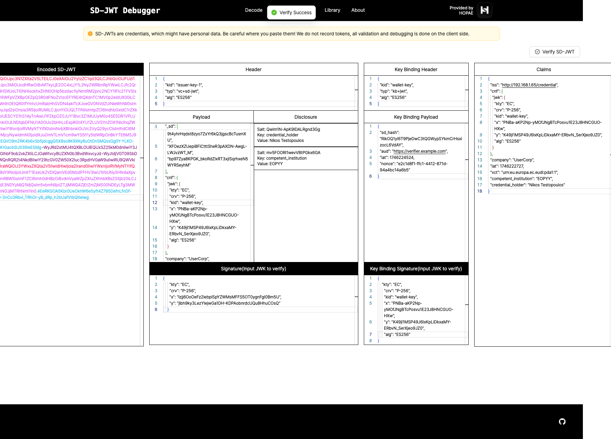

# Spring Boot SD-JWT & VCI/VP Demo
Explore how SD-JWTs, OIDC4VCI, and OIDC4VP enable user-consented, selective disclosure of Verifiable Credentials using open standards in a demo setup. The project also implements wallet attestation (WIA/WUA), DPoP-bound tokens, and Token Status List revocation, following the [HAIP (High Assurance Interoperability Profile)](https://openid.net/specs/openid4vc-high-assurance-interoperability-profile-1_0.html) specification and EUDI Architecture Reference Framework.

Related articles:
- [Verifiable Credentials with Spring Boot & Android](https://dzone.com/articles/verifiable-credentials-spring-boot-android)
- [Securing Verifiable Credentials with DPoP](https://dzone.com/articles/securing-verifiable-credentials-with-dpop-spring-boot)
- [HAIP 1.0: Securing Verifiable Presentations](https://dzone.com/articles/haip-1-0-securing-verifiable-presentations)
- More articles covering WIA, WUA, and Token Status List coming soon.

## Architecture

The system consists of four independent Spring Boot applications:

| Module | Port | Description |
|--------|------|-------------|
| **auth-server** | 9000 | OAuth2 Authorization Server with PAR, DPoP, and WIA-based client authentication |
| **issuer** | 8080 | Credential Issuer — validates WUA + Token Status List, issues SD-JWT credentials |
| **verifier** | 9002 | Credential Verifier — HAIP-compliant VP flow with JAR, DCQL, and encrypted responses |
| **wallet-provider** | 9001 | Issues Wallet Instance Attestations (WIA) and Wallet Unit Attestations (WUA) |

---

## VCI

### Wallet-Initiated Issuance after Installation

The End-User installs a new Wallet and opens it. The Wallet offers the End-User a selection of Credentials that the End-User may obtain from a Credential Issuer, e.g. a national identity Credential, a mobile driving license, or a public transport ticket. The corresponding Credential Issuers (and their URLs) are pre-configured by the Wallet or follow some discovery processes that are out of scope for this specification. By clicking on one of these options corresponding to the Credentials available for issuance, the issuance process starts using a flow supported by the Credential Issuer (Pre-Authorized Code flow or Authorization Code flow).

Wallet Providers may also provide a marketplace where Issuers can register to be found for Wallet-initiated flows.

References:
- https://openid.net/specs/openid-4-verifiable-credential-issuance-1_0.html#section-3.3.3
- https://openid.net/specs/openid-4-verifiable-credential-issuance-1_0.html#name-wallet-initiated-issuance-a

```
sequenceDiagram
    participant User
    participant WalletApp
    participant IssuerAuthServer as Authorization Server
    participant Issuer
    participant AuthenticSource

    User->>WalletApp: Opens wallet app
    User->>WalletApp: Unlocks app with biometrics
    User->>WalletApp: Selects "Request VC" deep link
    WalletApp->>IssuerAuthServer: Redirect to login (Auth Code Flow)

    Note over User,IssuerAuthServer: Browser is opened for authentication and consent

    User->>IssuerAuthServer: Provides credentials and consent
    IssuerAuthServer-->>WalletApp: Redirect with auth code (via deep link)
    WalletApp->>WalletApp: Generate DPoP proof
    WalletApp->>IssuerAuthServer: Exchange code for access token (with DPoP)
    IssuerAuthServer-->>WalletApp: Respond with DPoP-bound access token
    WalletApp->>WalletApp: Prepare credential request with JWT proof
    WalletApp->>Issuer: Call credential endpoint with JWT proof + DPoP
    Issuer->>Issuer: Validate DPoP proof and JWT proof
    Issuer->>AuthenticSource: Retrieve user credentials
    AuthenticSource-->>Issuer: Return credentials
    Issuer->>Issuer: Prepare SD-JWT with x5c header
    Issuer-->>WalletApp: Return SD-JWT (dc+sd-jwt format)
    WalletApp->>WalletApp: Verify SD-JWT signature using x5c certificate
    WalletApp->>WalletApp: Decode & Display verifiable credentials
    WalletApp->>WalletApp: Save credentials in Encrypted Shared Preferences
```


#### Issuance Enhancements

The VCI flow incorporates several security mechanisms beyond the basic Authorization Code Flow:

- **PAR (Pushed Authorization Requests)** — The wallet pushes authorization parameters to a dedicated endpoint before redirecting, preventing request tampering and reducing URL size (RFC 9126).
- **WIA + `attest_jwt_client_auth`** — At the PAR and Token endpoints the wallet presents a Wallet Instance Attestation (WIA) JWT issued by the wallet-provider together with a Proof-of-Possession JWT, implementing attestation-based client authentication per `draft-ietf-oauth-attestation-based-client-auth`.
- **DPoP** — Access tokens are sender-constrained via Demonstrating Proof-of-Possession (RFC 9449). The auth-server binds tokens to the wallet's DPoP key, and the issuer verifies the binding on each request.
- **WUA at credential endpoint** — The wallet includes a Wallet Unit Attestation (WUA) in the `key_attestation` header of the JWT proof. The issuer validates the WUA signature, checks the attested WSCD type (TEE/StrongBox), and verifies WUA revocation status against the wallet-provider's Token Status List before issuing the credential.

#### SD-JWT

The credential is issued in `dc+sd-jwt` format with an x5c certificate chain in the header for signature verification.

Sample (demo):
```
eyJ4NWMiOlsiTUlJQmtUQ0NBVGVnQXdJQkFnSVVkeVljbDE5ZFlCSjhtY1hHc2NqVXN4c2k2RGt3Q2dZSUtvWkl6ajBFQXdJd0hqRWNNQm9HQTFVRUF3d1RkbU10YVhOemRXVnlMbVYxWkdsM0xtUmxkakFlRncweU5qQXhNREl5TVRVeE1UbGFGdzB5TnpBeE1ESXlNVFV4TVRsYU1CNHhIREFhQmdOVkJBTU1FM1pqTFdsemMzVmxjaTVsZFdScGR5NWtaWFl3V1RBVEJnY3Foa2pPUFFJQkJnZ3Foa2pPUFFNQkJ3TkNBQVJ3Y08waG9qaFNOYzdvT3BTRHpYWWF0SnBvLzJKOENPSWxPOVdHRlpmR1JZVEhNalVjZTlBT0VhczVEU0NZQmREZ284WFVsM29XYXU2UC9KdytmbmlYbzFNd1VUQWRCZ05WSFE0RUZnUVVUVm82S2xNYjZxMkZETFg1UXFPMUV4NkM3b0l3SHdZRFZSMGpCQmd3Rm9BVVRWbzZLbE1iNnEyRkRMWDVRcU8xRXg2QzdvSXdEd1lEVlIwVEFRSC9CQVV3QXdFQi96QUtCZ2dxaGtqT1BRUURBZ05JQURCRkFpRUE2SXJlSU5TV3VyZFFQbjFtNGZCWDJCU2dMa1R4V3ZLOVBRTHgxN0FPaWdZQ0lHZWJZNlkyNnliUEhObnhRMkVpOW1CTFMrK1QwVWN0MXJQVWczQjkzdlJtIl0sImtpZCI6Imlzc3Vlci1rZXktMSIsInR5cCI6ImRjK3NkLWp3dCIsImFsZyI6IkVTMjU2In0.eyJpc3MiOiJodHRwOi8vMTkyLjE2OC4xMDAuNDQvY3JlZGVudGlhbCIsIl9zZCI6WyI3N2RZam5IeDM3RXJvWFdiMEk0Q3hSdS1KNVJKZG9SZWZsVS1mTHNObzljIiwiZTFpOTNVbnNTenR1QzJ3X1AyZnFxdU95Q01QX1VXYWJCdU16T1plRnVXbyIsInFqbndxTm5sekZXRFNWY0NCTDZYMGlrNHkyQXd0T245cDVuRkJ6Z3RUU0EiXSwiY25mIjp7Imp3ayI6eyJrdHkiOiJFQyIsImNydiI6IlAtMjU2Iiwia2lkIjoid2FsbGV0LWtleSIsIngiOiJ5WEFjd05UN0dRZlhwQzJIVmdSRmJlckgycjdYMzl1YXd0VkNaU1hTQVVVIiwieSI6IlNTY1QyWER0dHRqVkVaakRWdkNwaV9DbVY5TEJINUlwYkZoZmpMYjdKaTQiLCJhbGciOiJFUzI1NiJ9fSwiY29tcGFueSI6IlVzZXJDb3JwIiwiaWF0IjoxNzY3Nzg2ODM2LCJ2Y3QiOiJ1cm46ZXUuZXVyb3BhLmVjLmV1ZGk6cGRhMToxIn0.8szE4ppARFl4fVOYWboVeZHBiS0YquxxVG2Hza_Lpw8w-yU-fLOTvPRK4HC4a1Yub2S8kASSsBiZuSXhgLkiRA
```

💡 Paste it on https://www.sdjwt.co for inspection.


---

## Demo wallet app (Android)

Available [here](https://github.com/kmandalas/android-vci-vp) along with instructions.
Additionally, you can watch a screen recording that walks through the entire flow on [YouTube](https://youtube.com/shorts/cxIgyTR8s6w).

---

## VP

### Same Device Flow (our demo)

The verifier uses JWT-Secured Authorization Request (JAR) with x5c certificate chain for request authentication, and the wallet encrypts the VP response using ECDH-ES + A256GCM.

```
sequenceDiagram
    participant UA as User Agent
    participant W as Wallet
    participant V as Verifier
    participant IS as Issuer
    UA ->> V: Trigger presentation
    V ->> V: Generate ephemeral encryption key pair
    V ->> V: Create authorization request with DCQL query
    V ->> V: Sign request as JAR (JWT with x5c header)
    V -->> UA: Render request as QR/deep link (haip-vp://)
    UA ->> W: Trigger wallet and pass request
    W ->> V: GET request_uri (Accept: application/oauth-authz-req+jwt)
    V -->> W: Signed JAR
    W ->> W: Verify JAR signature using x5c certificate
    W ->> W: Validate x509_hash matches client_id
    W ->> W: Parse DCQL query from verified JWT
    W ->> W: Fetch locally stored VC
    W ->> W: Prompt user for selective disclosure
    W ->> W: Create VP with Key Binding JWT
    W ->> W: Encrypt response (ECDH-ES + A256GCM)
    W ->> V: POST encrypted vp_token (direct_post.jwt)
    V ->> V: Decrypt response with ephemeral private key
    V ->> IS: Fetch issuer's public key (or use x5c from credential)
    V ->> V: Verify SD-JWT credential signature
    V ->> V: Verify Key Binding JWT
    V -->> W: Return verification result
    W ->> W: Display verification outcome
```


### DCQL Query

The verifier uses DCQL (Digital Credentials Query Language) to request specific claims from credentials.

Sample (demo):
```json
{
  "client_id": "x509_hash:a54_NCUlnbgC-1PfaZIppUTinKy4ITcmSo6KtXxyFCE",
  "response_type": "vp_token",
  "response_mode": "direct_post.jwt",
  "response_uri": "https://verifier.example.com/verify-vp/{requestId}",
  "nonce": "e2c1d8f1-ffc1-4412-871d-94a4bc14a6b5",
  "dcql_query": {
    "credentials": [
      {
        "id": "pda1_credential",
        "format": "dc+sd-jwt",
        "meta": {
          "vct_values": ["urn:eu.europa.ec.eudi:pda1:1"]
        },
        "claims": [
          { "path": ["credential_holder"] },
          { "path": ["nationality"] },
          { "path": ["competent_institution"] }
        ]
      }
    ]
  },
  "client_metadata": {
    "client_name": "Demo Verifier Inc.",
    "logo_uri": "https://example.com/logo.png",
    "purpose": "Verify your Portable Document A1 credentials",
    "jwks": {
      "keys": [{ "kty": "EC", "crv": "P-256", "...": "ephemeral encryption key" }]
    },
    "authorization_encrypted_response_alg": "ECDH-ES",
    "authorization_encrypted_response_enc": "A256GCM"
  }
}
```

### vp_token Response

The wallet sends an encrypted JWE containing the vp_token in DCQL format:

```json
{
  "vp_token": {
    "pda1_credential": ["<SD-JWT with disclosures and KB-JWT>"]
  },
  "state": "optional-state-value"
}
```

Sample vp_token (demo):
```
eyJ4NWMiOlsiTUlJQmtUQ0NBVGVnQXdJQkFnSVVkeVljbDE5ZFlCSjhtY1hHc2NqVXN4c2k2RGt3Q2dZSUtvWkl6ajBFQXdJd0hqRWNNQm9HQTFVRUF3d1RkbU10YVhOemRXVnlMbVYxWkdsM0xtUmxkakFlRncweU5qQXhNREl5TVRVeE1UbGFGdzB5TnpBeE1ESXlNVFV4TVRsYU1CNHhIREFhQmdOVkJBTU1FM1pqTFdsemMzVmxjaTVsZFdScGR5NWtaWFl3V1RBVEJnY3Foa2pPUFFJQkJnZ3Foa2pPUFFNQkJ3TkNBQVJ3Y08waG9qaFNOYzdvT3BTRHpYWWF0SnBvLzJKOENPSWxPOVdHRlpmR1JZVEhNalVjZTlBT0VhczVEU0NZQmREZ284WFVsM29XYXU2UC9KdytmbmlYbzFNd1VUQWRCZ05WSFE0RUZnUVVUVm82S2xNYjZxMkZETFg1UXFPMUV4NkM3b0l3SHdZRFZSMGpCQmd3Rm9BVVRWbzZLbE1iNnEyRkRMWDVRcU8xRXg2QzdvSXdEd1lEVlIwVEFRSC9CQVV3QXdFQi96QUtCZ2dxaGtqT1BRUURBZ05JQURCRkFpRUE2SXJlSU5TV3VyZFFQbjFtNGZCWDJCU2dMa1R4V3ZLOVBRTHgxN0FPaWdZQ0lHZWJZNlkyNnliUEhObnhRMkVpOW1CTFMrK1QwVWN0MXJQVWczQjkzdlJtIl0sImtpZCI6Imlzc3Vlci1rZXktMSIsInR5cCI6ImRjK3NkLWp3dCIsImFsZyI6IkVTMjU2In0.eyJpc3MiOiJodHRwOi8vMTkyLjE2OC4xMDAuNDQvY3JlZGVudGlhbCIsIl9zZCI6WyJIYlpUZ0Qyb1dTXzFlbUo2SW1FVi1aV0FULWN0dGw0bncyaFVJcDJiTXdjIiwiU2pSZXpkRU9xcE1kTVRval82NnpDbjVoMFVibHNlb3ZzeWNQX3BtSFZRcyIsInhmVzFKQU1CdjE4dTJabjA0S3N3V0RMUXJ3RW9ZWkJnekUzcmk0Qk54UkUiXSwiY25mIjp7Imp3ayI6eyJrdHkiOiJFQyIsImNydiI6IlAtMjU2Iiwia2lkIjoid2FsbGV0LWtleSIsIngiOiJPdy1qcGItc1VMRlQtcGxnR3RxSm9lVUUtVWhBTWNKYVVqa0N1VVJkeHVVIiwieSI6IndxYzhXeWZ1T3RRN0hqSnJvV3VfXzZVZGo4Z3J0V0pBN2t6WEZkSjZxaWciLCJhbGciOiJFUzI1NiJ9fSwiY29tcGFueSI6IlVzZXJDb3JwIiwiaWF0IjoxNzY3ODc1NjY1LCJ2Y3QiOiJ1cm46ZXUuZXVyb3BhLmVjLmV1ZGk6cGRhMToxIn0.Zu5Q9QOh3mxf-7TSA_rtlflh64bLThwsp8JTRWRdgEwmwKsycliE7A47nfGTdbhO-fcJ-12kiqP6U9u2niq8iA
```

💡 Paste it on https://www.sdjwt.co for inspection.



### QR code and Deep Link

The verifier generates deep links using the `haip-vp://` scheme (HAIP compliant) or `openid4vp://`:

```
haip-vp://?client_id=x509_hash%3Aa54_NCUlnbgC-1PfaZIppUTinKy4ITcmSo6KtXxyFCE&request_uri=https%3A%2F%2Fverifier.example.com%2Frequest-object%2F{requestId}
```

---

## Wallet Provider

The wallet-provider module acts as the trust anchor for wallet instances and their hardware-backed keys.

**WIA (Wallet Instance Attestation)** — Issues `oauth-client-attestation+jwt` tokens that attest the wallet app's integrity and bind it to an ephemeral public key. The auth-server validates WIA at the PAR and Token endpoints to authenticate wallet clients without shared secrets.

**WUA (Wallet Unit Attestation)** — Issues `key-attestation+jwt` tokens after validating Android Key Attestation certificate chains against Google's root CA. The WUA captures the key's security level (software, TEE, or StrongBox) and maps it to ISO 18045 attack-potential resistance levels. The issuer checks the WUA before issuing credentials.

**Token Status List** — Each WUA is assigned an index in a compressed bitstring published as a signed JWT (`application/statuslist+jwt`) per `draft-ietf-oauth-status-list`. The issuer fetches the status list and checks the relevant bit to determine whether a WUA has been revoked, providing a privacy-preserving revocation mechanism.

---

## HAIP Features

This implementation includes the following HAIP-compliant features:

| Feature | Description |
|---------|-------------|
| **PAR** | Pushed Authorization Requests (RFC 9126) |
| **WIA** | Wallet Instance Attestation with `attest_jwt_client_auth` (`draft-ietf-oauth-attestation-based-client-auth`) |
| **WUA** | Wallet Unit Attestation for hardware key security with Token Status List revocation |
| **DPoP** | Demonstrating Proof of Possession for access tokens (RFC 9449) |
| **JAR with x5c** | JWT-Secured Authorization Requests signed with X.509 certificate |
| **x509_hash client_id** | Client identification via SHA-256 hash of DER-encoded certificate |
| **DCQL** | Digital Credentials Query Language for credential requests |
| **dc+sd-jwt** | HAIP-compliant credential format with x5c header |
| **VP Encryption** | Response encryption using ECDH-ES + A256GCM |
| **haip-vp:// scheme** | HAIP-compliant URI scheme for wallet invocation |

---

<details>
<summary>⚠️ Disclaimer</summary>

This repo contains an **experimental project** created for learning and demonstration purposes. The implementation is **not intended for production** use.

</details>
